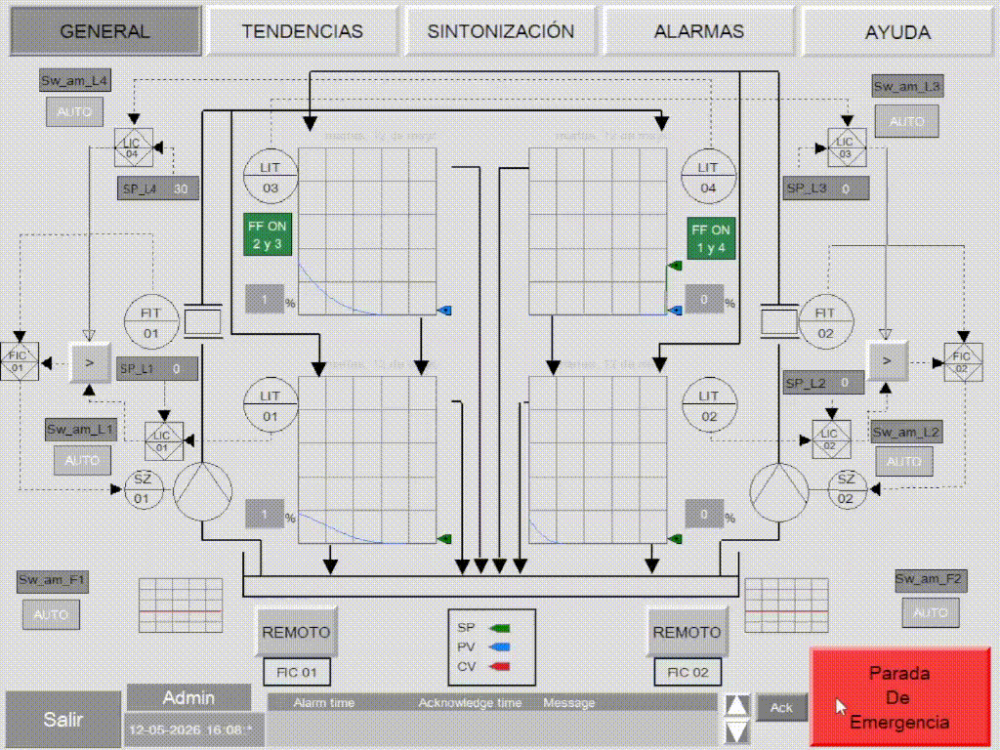
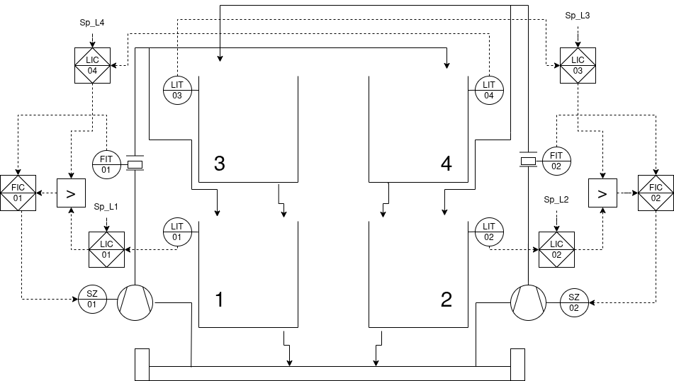

# Sistema de Control para Planta Piloto de 4 Estanques

🇬🇧 [English version](README.md)

## Descripción General
Este repositorio documenta el diseño, simulación e implementación de un sistema de control automático para una planta piloto de 4 estanques. El proyecto abarca desde el modelado matemático y la discretización de sistemas continuos, hasta la síntesis de algoritmos de control avanzado, llevando la teoría rigurosa hacia su aplicación directa en hardware industrial.

▶️ **Videos Demostrativos:** 

[Control PID con Feedforward](https://youtu.be/Ni7OxD4VFhw)

[Control Predictivo Adaptativo con horizonte extendido](https://youtu.be/QE6KxWTnEUY)

📄 **Reporte Técnico Completo:** [Reporte Técnico (PDF)](docs/documentacion/main.pdf) — desarrollo matemático, síntesis del controlador, y el registro completo de troubleshooting en tiempo real sobre la planta.

### Simulador de Puntos de Operación MIMO
> [Simulador interactivo — click aquí](https://aguscsc.github.io/Sistema-de-Control-para-Planta-Piloto-de-4-Estanques/simulaciones/index.html)

## HMI

*Interfaz Humano-Máquina diseñada bajo la norma ISA-101.*

## Arquitectura de Control y P&ID

*Diagrama de instrumentación basado en la norma ISA-5.1, detallando los lazos de control de nivel (LIC) y flujo (FIC).*

## Alcance Técnico del Proyecto
* **Control en Tiempo Real:** Diseño y sintonización de controladores discretos monovariables para la dinámica en cascada de los estanques.
* **Control Predictivo Adaptativo:** Control por Horizonte Extendido Autoajustable (HOREXT), derivado de forma independiente a partir de Ydstie, Kershenbaum & Sargent (1985) — identificación en línea vía RLS con factor de olvido variable de Fortescue, extrapolada a un predictor multi-paso, sintonizada y validada en lazo cerrado sobre la planta física.
* **Comunicaciones Industriales:** Protocolos de transmisión de datos para la sincronización robusta entre instrumentación, PLC y equipos computacionales.
* **Diseño de Interfaz (HMI):** Interfaces gráficas para operación y monitoreo, estructuradas bajo el estándar de alto desempeño **ISA-101**.

## Tecnologías y Herramientas Utilizadas
* **Hardware de Control:** Allen-Bradley ControlLogix 1756-L81E.
* **Programación PLC:** Studio 5000 (Rockwell Automation), Structured Text (IEC 61131-3).
* **Desarrollo HMI:** FactoryTalk (Rockwell Automation).
* **Comunicación:** Protocolo EtherNet/IP y servidor OPC UA (FactoryTalk Gateway) para integración con MATLAB/Simulink.
* **Simulación y Análisis:** MATLAB / Simulink, Python.

---
## Ingenieros
- **[Agustín Torres](https://github.com/aguscsc)**
- **[Ignacio Cerda](https://github.com/LovesCharlie)**
- **[Leví Sojos](https://github.com/gadivalr)**

---
