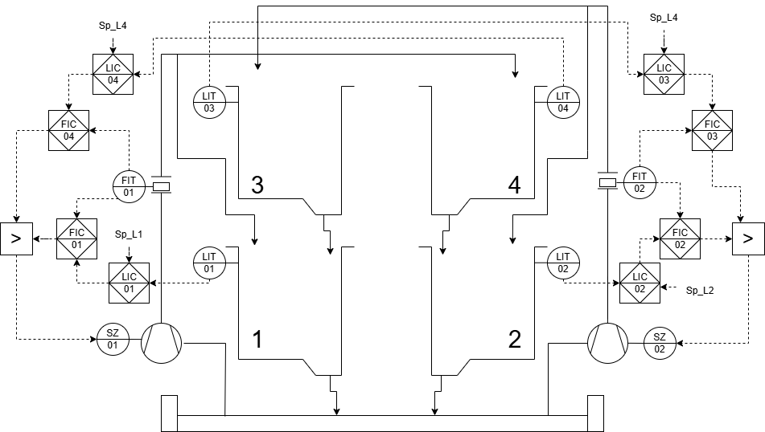

# Sistema de Control para Planta Piloto de 4 Estanques

## Descripción General
Este repositorio documenta el diseño, simulación e implementación de un sistema de control automático para una planta piloto de 4 estanques. El proyecto abarca desde el modelado matemático y la discretización de sistemas continuos, hasta la síntesis de algoritmos de control avanzado, llevando la teoría rigurosa hacia su aplicación directa en hardware industrial.

## Arquitectura de Control y P&ID

*Diagrama de Instrumentación basado en la norma ISA-5.1, detallando los lazos de control de nivel (LIC) y flujo (FIC).*

## Alcance Técnico del Proyecto
* **Control en Tiempo Real:** Implementación y sintonización de controladores discretos monovariables aplicados a la dinámica de los estanques.
* **Control Predictivo Adaptativo:** Desarrollo de estrategias de control estocástico e implícito para mitigar perturbaciones, minimizar la varianza y optimizar el rendimiento del sistema.
* **Comunicaciones Industriales:** Configuración de protocolos de transmisión de datos para la sincronización robusta entre instrumentación, PLC y equipos computacionales.
* **Diseño de Interfaz (HMI):** Desarrollo de interfaces gráficas para operación y monitoreo estructuradas bajo el estándar **ISA-101** de alto desempeño visual.

## Tecnologías y Herramientas Utilizadas
* **Hardware de Control:** Allen-Bradley ControlLogix 1756-L81E.
* **Programación PLC:** Studio 5000 (Rockwell Automation).
* **Desarrollo HMI:** FactoryTalk (Rockwell Automation).
* **Comunicación:** Protocolo EtherNet/IP y servidor OPC UA (FactoryTalk Gateway) para integración con Matlab/Simulink.
* **Simulación y Análisis:** Matlab / Simulink.

---
## Ingenieros
- **[Agustín Torres](https://github.com/aguscsc)**  
- **[Ignacio Cerda](https://github.com/LovesCharlie)**  
- **[Leví Sojos](https://github.com/gadivalr)**  

---
